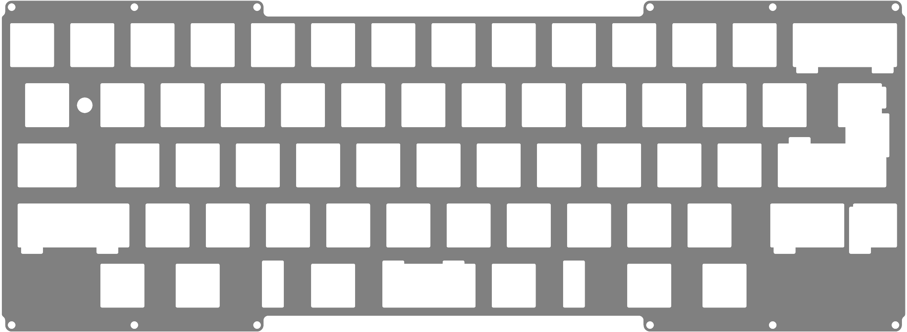
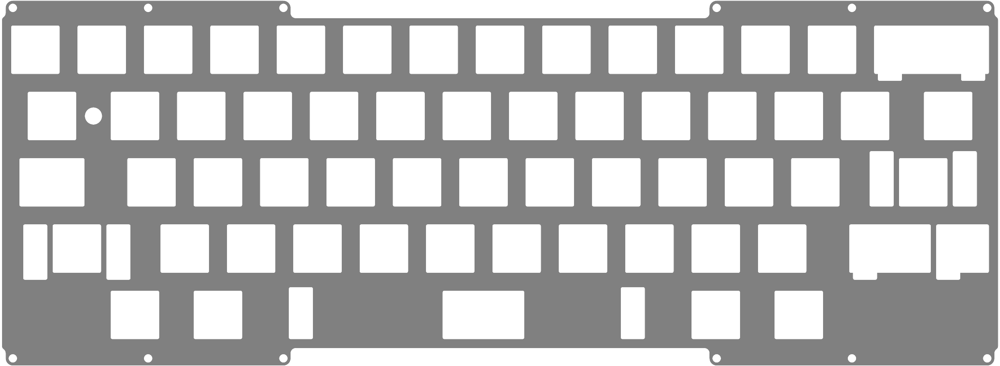
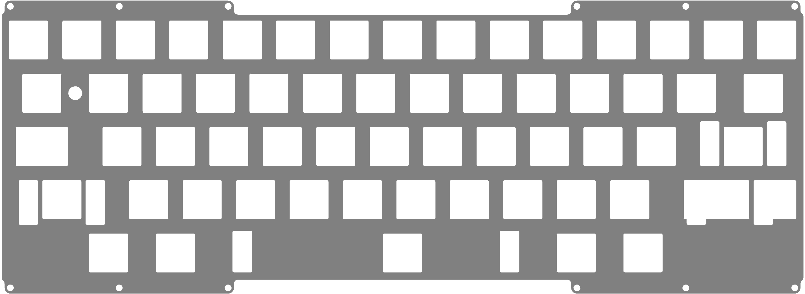
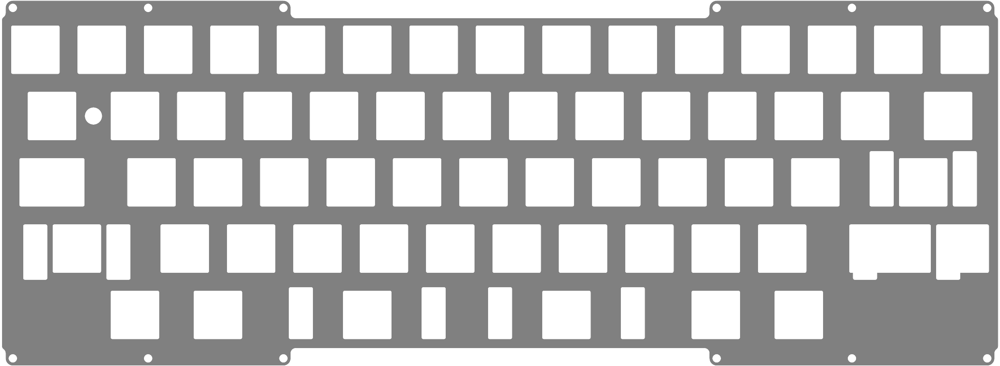

### Vero_Universal_Plate

Universal plate for all materials.

* [Vero_Universal_Plate.step](./Vero_Universal_Plate.step)
* [Vero_Universal_Plate.dxf](./Vero_Universal_Plate.dxf)

### Vero_HHKB_FullBS

Fixed HHKB layout, with additional support for full backspace.

* [Vero_HHKB_FullBS.step](./Vero_HHKB_FullBS.step)
* [Vero_HHKB_FullBS.dxf](./Vero_HHKB_FullBS.dxf)

### Vero_HHKB_OC6u

Fixed HHKB layout, with fixed off-center 6u spacebar.

* [Vero_HHKB_OC6u.step](./Vero_HHKB_OC6u.step)
* [Vero_HHKB_OC6u.dxf](./Vero_HHKB_OC6u.dxf)

### Vero_Split_Spacebar

Fixed HHKB layout, but with fixed 2 x 3u spacebars.

* [Vero_Split_Spacebar.step](./Vero_Split_Spacebar.step)
* [Vero_Split_Spacebar.dxf](./Vero_Split_Spacebar.dxf)
