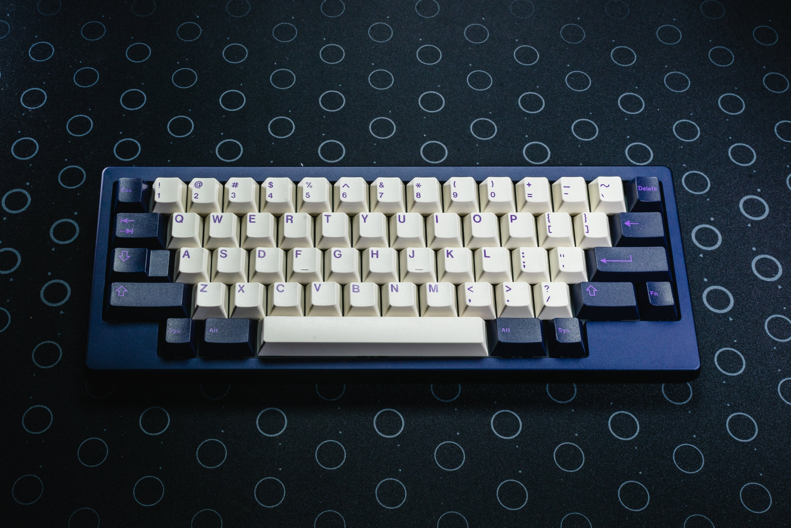
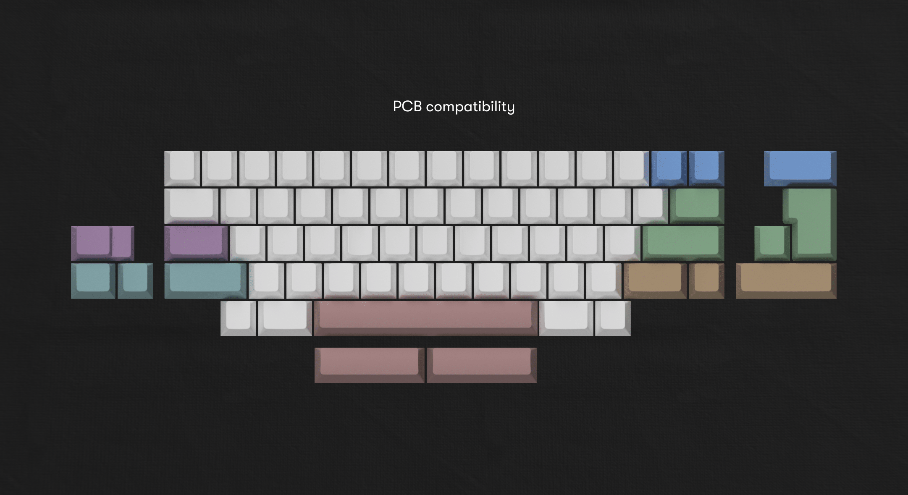
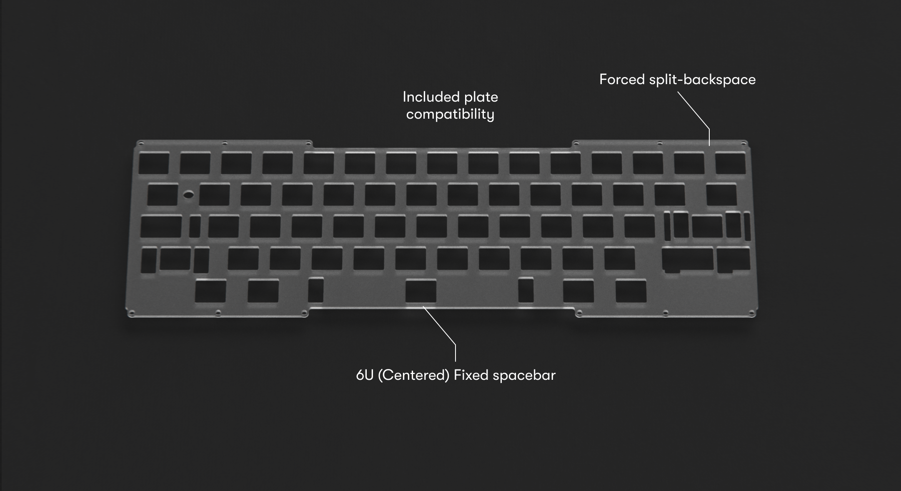

# AKB Vero

Vero means true. This keyboard brings you a truly great typing experience in a true HHKB layout. With its 6u spacebar and asymmetrical blockers it brings the classic design of the HHKB to MX keyboards.

Sold exclusively via [Antipode Studio](https://www.antipode.no/products/akb-vero).

* [Website](https://alchemistkeyboards.com/projects/keyboards/vero/)

## Specifications

* 6.9 degree typing angle
* Clean seamless construction
* Designed around the true HHKB layout
* 6063 Aluminium case
* Engraved brass/copper weight
* QMK/VIA compatible PCB
* Top-mounted daughterboard for easier assembly
* Available in “Void” and “Midnight”
* Frosted PC Plate (fixed layout)
* 16.65mm front height (plus bumpons)

## Layout support

## Kit contents

* 1× Top Case
* 1× Bottom Case
* 1× Solder PCB
* 1× 1.5mm PC plate
* 1× AKB slimline daughterboard
* 4× [AKB Bumpons](https://github.com/akb-repos/feet) – Injection molded silicone
* 1× 6u and 2× 3u stabilizer wires
* 1× Carry Case
* 4× Torx countersunk screw M3 x 5mm (weight)
* 4× Torx screw M3 x 12mm (case)
* 12× Torx screw M2 x 5mm (plate)
* 2× Torx screw M2 x 4mm (daughterboard)

## Media

### Showcase
* [Antipode](https://www.youtube.com/watch?v=uqEc-omd_7k)
* [Alexotos](https://www.youtube.com/watch?v=KnBZ_xWmKAg)

### Build streams
* [Lulzthax](https://www.youtube.com/watch?v=5WctjDuRTno)
* [Alexotos](https://www.youtube.com/watch?v=J3E9D6jxPEQ)

### Typing tests
* [Poes - Vero with Gateron Inks](https://www.youtube.com/watch?v=S4EZzdk6aKU)

## Render model
* [Render model](./rendering/Vero_Render_Model.step)
